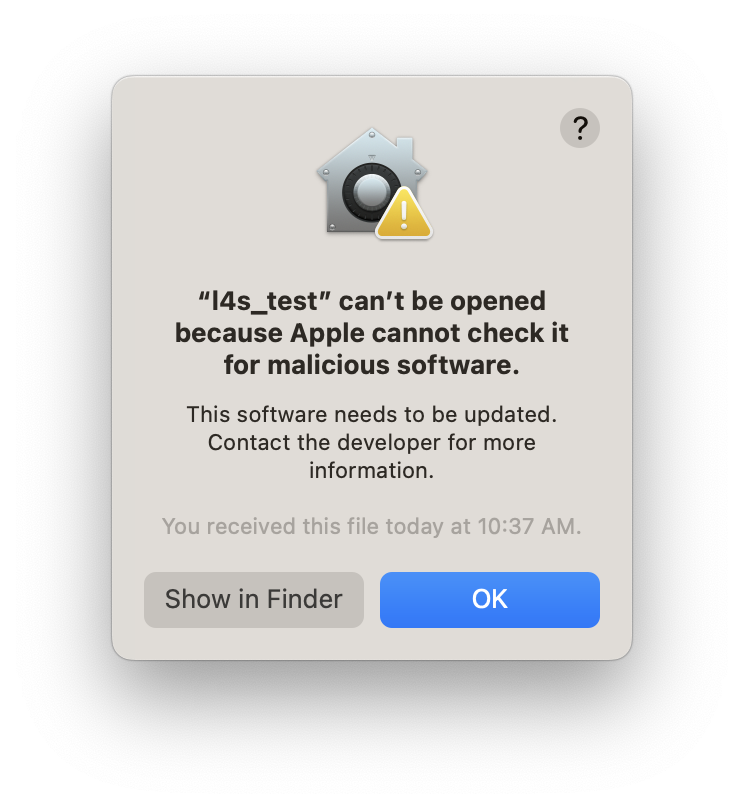
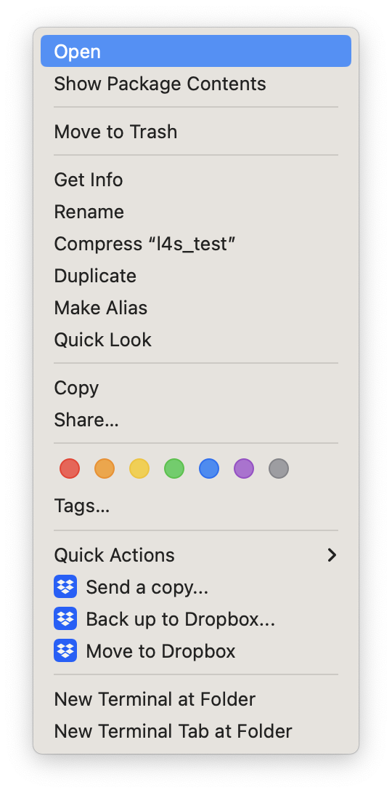
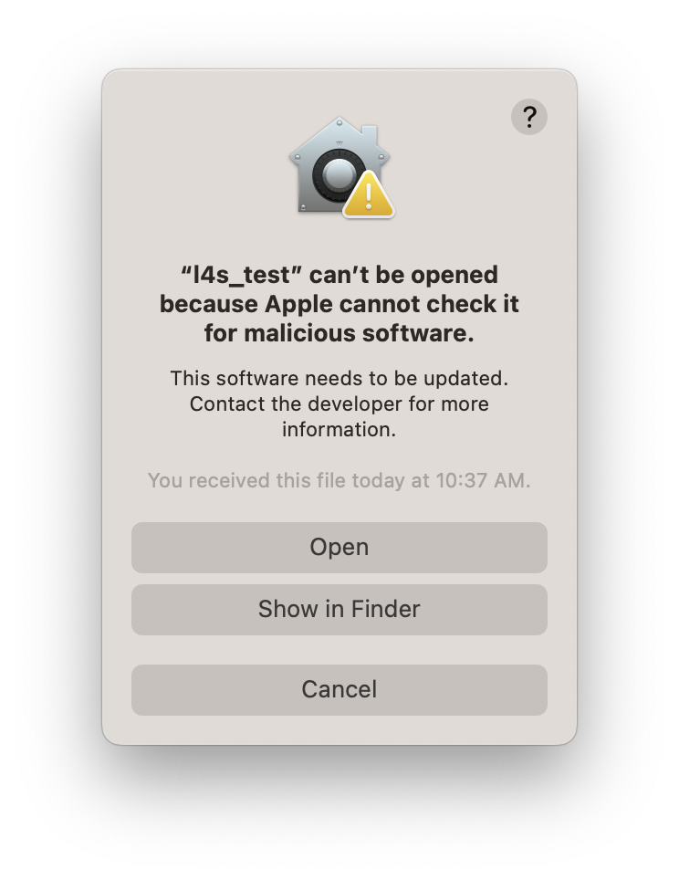
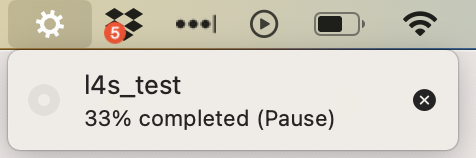
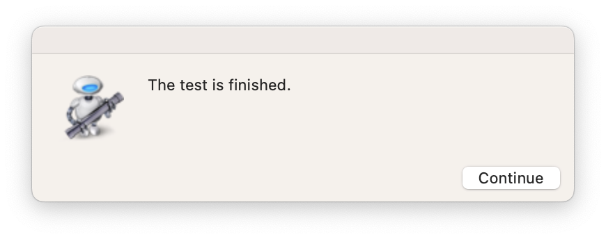
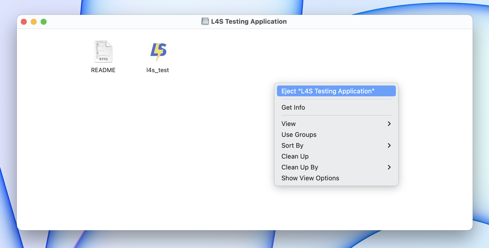

# Week 5 - CableLabs L4S Test App on Mac

*This testing applies to users of macOS 13 or 14 only.  Skip this if you don't have one.*

L4S Test App by CableLabs (www.cablelabs.com) runs upstream and downstream traffic with combinations of L4S-On and -Off streams and measures the latency.

## Action Requested

1. Download the L4S Test App
   * Visit https://github.com/jlivingood/IETF-L4S-Deployment/blob/main/CableLabs_L4S_Testing_Application.dmg
   * Click the *Download raw file* icon on the right of page

         

1. Open the downloaded `.dmg` file.  The *L4S Test Application* volume will be open as a folder.
1. Double click `l4s_test` in the folder.
   * When you first double click the app, you may get a MacOS security warning that this app hasn’t been checked by Apple:

         

   * The solution is to right click (or CTRL-click) on the app and select “Open”

     

   * You’ll then get an option to bypass the security check and Open the app:

     

   * You will only need to do that once. After that, you can simply double click the app to run it.
1. When you run the app, you won’t see any feedback while its running except for a spinning gear symbol in your menu bar. If you click on the spinning gear, you will see a little dropdown:

     

1. It will always say 33% while it is running.  It should run about 1 minute, and then produce a little dialog box saying “The test is finished”.

     

1. Once testing is done, you can eject the *L4S Test Application* volume with a right click on the folder or icon on desktop, or on the Finder.

     

The measurements will be collected at CableLabs' server, so no need to submit results.

## Report Problems Here: 
https://app.smartsheet.com/b/form/c91c06bb97914742bdf54f25e294eb07
